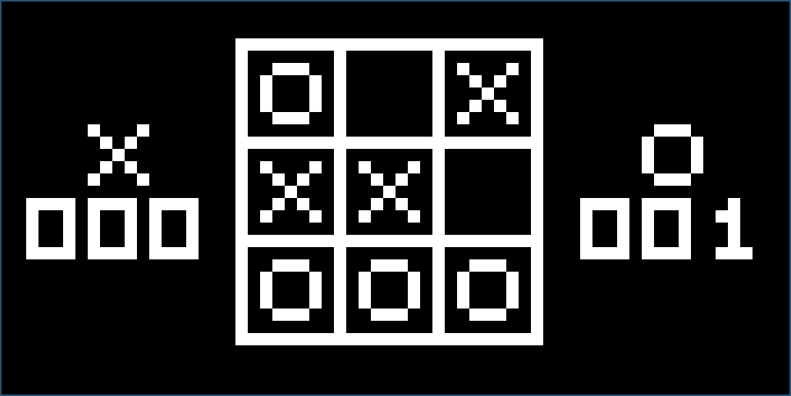
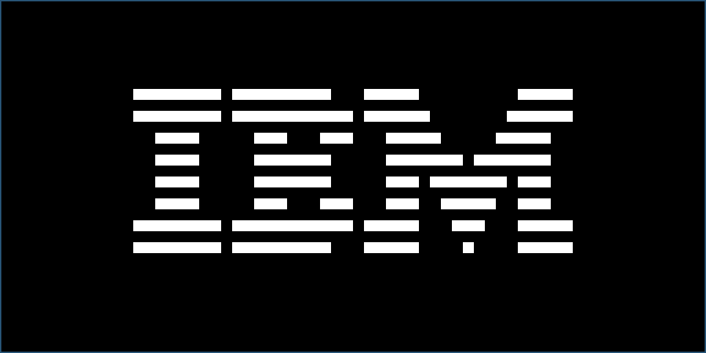

# Chip 8 Emulator

An emulator for the Chip 8 virtual machine, written in C++.

> CHIP-8 is an interpreted programming language, developed by Joseph Weisbecker. It was initially used on the COSMAC VIP and Telmac 1800 8-bit microcomputers in the mid-1970s. CHIP-8 programs are run on a CHIP-8 virtual machine. It was made to allow video games to be more easily programmed for these computers, but CHIP 8 is still used today, due to its simplicity, and consequently on any platform and its teaching of programming Binary numbers. 

source: https://en.wikipedia.org/wiki/CHIP-8

## Installation

Requires cmake and SDL2

```bash
# Apt package manager
apt install cmake libsdl2-dev

# Brew
brew install cmake sdl2
```

Build
```bash
mkdir build && cd build
cmake ..
make
```

Run
```bash
./chip8 <ROM path>
```

## Screenshots


Tic Tac Toe


IBM Bootscreen

## ROMs

https://github.com/kripod/chip8-roms

## References

- https://en.wikipedia.org/wiki/CHIP-8
- https://multigesture.net/articles/how-to-write-an-emulator-chip-8-interpreter/
- https://www.reddit.com/r/EmuDev/
